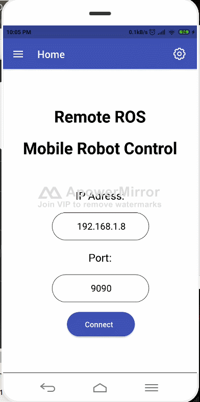
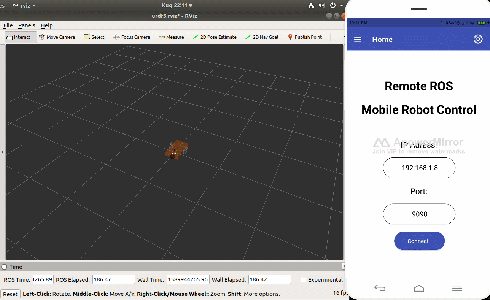
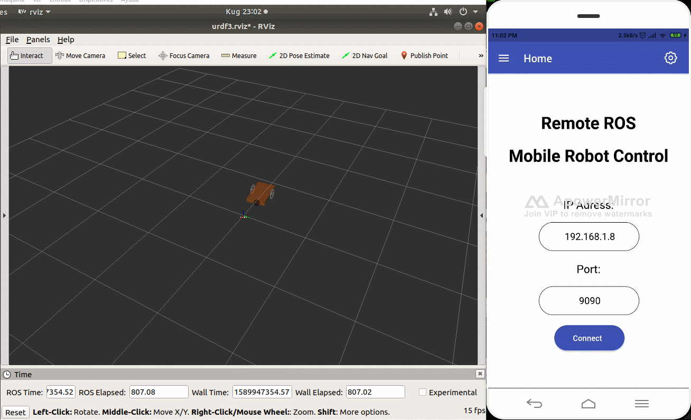

# React Native App for a differential mobile robot
<!-- markdownlint-disable MD033 -->
## 1. Prerequisites

Have installed on your computer, ROS Melodic, ROS Melodic packages: gazebo ros plugin, gazebo ros, react-native.

Having created a catkin workspace.

## 2. Packages

The ReactNativeControl folder has the control of robot and the interaction with the reat-native app. If you want to use the same robot, I invite you a my other porject a clone the repository:

<https://github.com/Juanesb230/PYQT-RVIZ>

The react-native app is into NativePrueba folder online clone the repository, go to the NativePrueba folder and puth the followings command:

npm option:

    npm install

or yarn option:

    yarn install

runs the aplication with an emulator of your phone:

    react-native run-android

For the master, you have to init the rosbridge server with this command:

    roslaunch rosbridge_server rosbridge_websocket.launch

If you want to use the robot designed, you have to install the package of the previous link in your catkin workspace, and put the following command in other terminal:

    roslaunch diferencial 01-diferencial.launch

Finally, have to run the control node, for that you have to install as package the ReactNativeControl folder in your catkin workspace and put the next line:

    rosrun ReactNativeControl ControlReactNative.py

## 3. Description

The App is a ROS node that can communicate with the master with rosbridge. For the frond-end I use native-base and for the ROS interaction I use roslibjs. This app use Redux and Redux-persist for managing the states of the app, as you can see in the animation:

  

And the next animation shows the communication of the App with the master node with rosbridge.

  

## 4. Results

In this demostration I use my Android cellphone and ApowerMirror for shows the screen of phone. If you want to use ApowerMirror you can donwload in the next link:

<https://www.apowersoft.es/phone-mirror>

This app publish a topic named "/mode" for the controller know if the app user is in teleoperation, posture or trajectory control mode. The next Table shows the messages sends to the topic "/mode" depending the app mode operation that the ControlReactNative node is suscribed:

| Mode | Message (stds_msgs:string) |
| --- | --- |
| Teleoperation | 'Teleoperation' |
| Posture Control | 'Posture Control' |
| Trajectory Control | 'Tray Control' |

For teleoperation mode, you can chose the name topic  to publihs velocities of robot. For my robot, the name topic is "/mobile_base_controller/cmd_vel", this animation shows the teleoperation mode.

  

In the settings button, you can set the velocities of robot.

In the posture control mode, the user can set the X, Y position and the robot is going to that point. The x and y references is sending as  ROS´parameters. The next animation shows the posture control mode of the robot.

  

Finally the trajectory mode, this mode the user can chose the trajectory of the robot. When you chose a different trajectory the app sends a ROS' parameter named TrayMode. The following animation shows this mode.

  

## 5. Contact with me

Linkedin: <www.linkedin.com/in/juan-balseca-pinto-9117b397>
